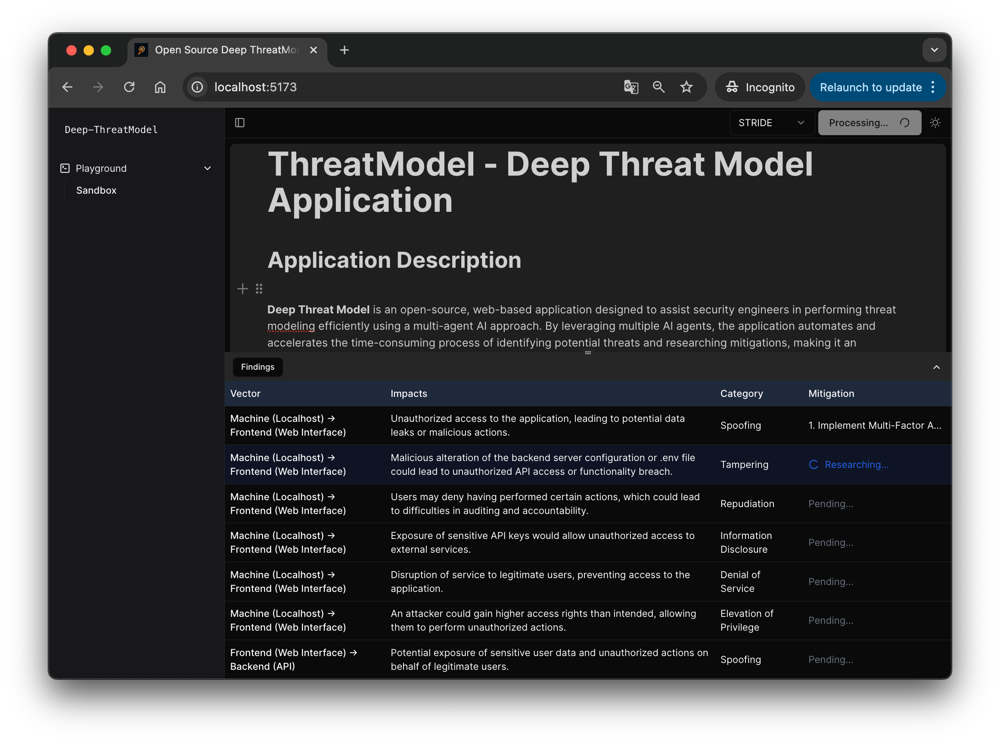

# DeepThreatModel 
DeepThreatModel, or Deep-TM, use of multiple AI agents tool to compose a threat model. The modeling results are expected to be deeply researched, verified.

⭐️ If you find this project useful, please consider starring it and share to more people.⭐️



## Features
- Multi-agent architecture
- Confluence/Notion like block style interface
- Generate threat models with STRIDE methodology
- Applying deep-research on mitigations
- Support mermaid markdown as diagram input

## Roadmaps
- [x] Build the multi agent architecture
- [x] Build an intuitive editor to gather user inputs (e.g. Diagram, Design, Assumption, etc) 
- [x] Generate threat mitigation with deep-research agent
- [x] Adding support STRIDE methodology
- [ ] Adding support DREAD methodology 

## Quick Start with Docker Compose
To use DeepThreatModel, you’ll need API keys for OpenAI and Google Custom Search Engine (CSE). Below are instructions on how to obtain them, followed by steps to set up the project using Docker Compose.

### Retrieving API Keys
1. OpenAI API Key:
   - Sign up for an account at OpenAI.
   - Once logged in, navigate to the API section and generate a new API key.
   - Copy this key for use in the .env file.
2. Google API Key and CSE ID:
   - Go to the Google Cloud Console.
   - Create a new project (or use an existing one).
   - Enable the Custom Search API in the API Library.
   - Generate an API key under Credentials > Create Credentials > API Key.
   - Set up a Custom Search Engine (CSE) at Google CSE and obtain your CSE ID.
   - Copy both the API key and CSE ID for use in the .env file.

### Setup the container
1. Clone or Download the Project 
2. Create your `.env`
    ```bash
        OPENAI_API_KEY=your_actual_openai_api_key
        GOOGLE_API_KEY=your_actual_google_api_key
        GOOGLE_CSE_ID=your_actual_google_cse_id
    ```
3. Build and Start the Containers `docker compose up -d`
4. Access at `http://localhost:5173`

## Acknowledgements
Deep-ThreatModel couldn't have been built without the help of great software already available from the community. Thank you.
- [mermaidjs](https://github.com/mermaid-js/mermaid)
- [BlockNote](https://github.com/TypeCellOS/BlockNote)
- [pydantic-ai](https://github.com/pydantic/pydantic-ai)

## Contributing
All kind of contributions are welcome. I don't have any "Developer Guide" at this moment. For any breaking changes, feel free to create an issue and leave your thoughts there.

## License
This project is licensed under the MIT License