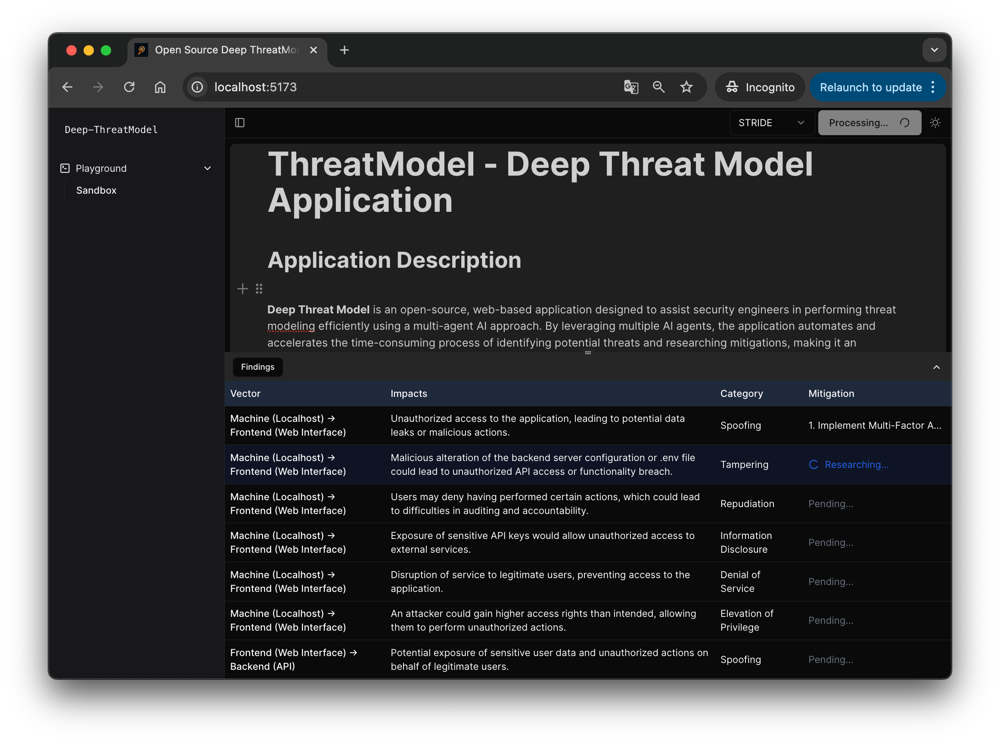

# Deep-ThreatModel 
Deep-TreatModel is an advanced threat modeling tool that leverages multiple AI agents to craft comprehensive and reliable threat models. By distributing the workload across specialized agents, Deep-TM meticulously analyzes design documents, identifies threats using the STRIDE framework, and researches mitigations from authoritative sources like OWASP, and MITRE. This collaborative approach ensures that the resulting threat models are not only deeply researched but also thoroughly verified, providing you with dependable insights tailored to your system’s architecture.

⭐️ If you find this project useful, please consider starring it and share to more people.⭐️

## Features
- Multi-agent architecture
- Confluence/Notion like block style interface
- Generate threat models with STRIDE methodology
- Applying deep-research on mitigations
- Support mermaid markdown as diagram input

## Roadmaps
- [x] Build the multi agent architecture
- [x] Build an intuitive editor to gather user inputs (e.g. Diagram, Design, Assumption, etc) 
- [x] Generate threat mitigation with deep-research agent
- [x] Adding support STRIDE methodology
- [ ] Adding support DREAD methodology 
- [ ] Allow authoritive source preferences

## Getting Started
Please go to our [Getting Started Page](https://github.com/ph20Eoow/deep-threat-model/wiki/Getting-Started) in the wiki to checkout the quick start guide

## Acknowledgements
Deep-ThreatModel couldn't have been built without the help of great software already available from the community. Thank you.
- [mermaidjs](https://github.com/mermaid-js/mermaid)
- [BlockNote](https://github.com/TypeCellOS/BlockNote)
- [pydantic-ai](https://github.com/pydantic/pydantic-ai)

## Contributing
All kind of contributions are welcome. I don't have any "Developer Guide" at this moment. For any breaking changes, feel free to create an issue and leave your thoughts there; Feature requests are welcome too.

## License
This project is licensed under the MIT License