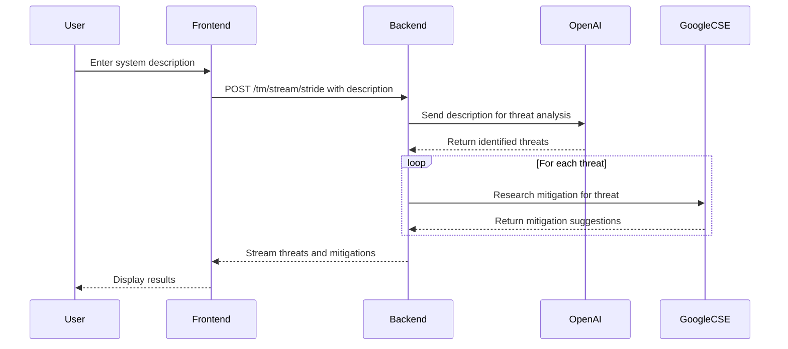

# ThreatModel - Deep Threat Model Application

## Application Description

**Deep Threat Model** is an open-source, web-based application designed to assist security engineers in performing threat modeling efficiently using a multi-agent AI approach. By leveraging multiple AI agents, the application automates and accelerates the time-consuming process of identifying potential threats and researching mitigations, making it an invaluable tool for security professionals. The application is lightweight, runs locally on the user's machine, and requires no persistent database, relying instead on real-time processing and external AI services.

### Key Features

*   **Multi-Agent AI System**: Employs distinct AI agents for threat identification and mitigation research.
*   **Local Deployment**: Runs on the user’s machine using Docker Compose, ensuring easy setup and isolation.
*   **Web Interface**: Provides a user-friendly frontend accessible at localhost:5173.
*   **API-Driven**: Exposes a backend API at localhost:8000 to handle user requests and coordinate AI interactions.
*   **No Database**: Operates without a database, processing data in memory for simplicity and speed.
*   **External API Integration**: Requires OpenAI and Google Custom Search Engine (CSE) API keys, configured via a .env file.

## Assumptions

*   **Local Execution**: The application is designed to run locally on the user's machine using Docker Compose, encapsulating all components (frontend, backend, and dependencies) in containers.
*   **Backend API**: The backend exposes its API on port 8000, accessible at localhost:8000.
*   **Frontend Access**: Users interact with the application through a web interface at localhost:5173.
*   **No Database**: The application does not use a persistent database; all data is processed in memory during runtime.
*   **API Key Configuration**: Requires OpenAI and Google CSE API keys, provided via a .env file when launching the application with Docker Compose. These keys are loaded at startup to enable AI agent functionality.
*   **Stateless Design**: Each user request is handled independently, with no reliance on stored state between sessions.

## Architecture

The Deep Threat Model application follows a client-server architecture with the following components:

*   **Frontend**: A web application running at localhost:5173, likely built with a modern JavaScript framework (e.g., React, Vue, or Angular), providing an interface for users to input system descriptions and view results.

*   **Backend**: A server running at localhost:8000, exposing an API to process user requests and orchestrate interactions with AI agents.

*   **AI Agents**:

    *   **Threat Identification Agent**: Uses OpenAI to analyze user-provided system descriptions and identify potential threats.
    *   **Mitigation Agent**: Utilizes Google CSE to research and suggest mitigations for identified threats.

## API Endpoints

*   **/tm/stream/stride**:

    *   **Method**: POST
    *   **Description**: This endpoint handles user requests for threat modeling. It accepts a system description or requirements as input, processes it using the AI agents, and streams back a response containing identified threats and mitigation suggestions.

**Workflow**:

1.  Receives system description from the frontend.
2.  Passes the description to the Threat Identification Agent (OpenAI) to identify threats.
3.  For each threat, invokes the Mitigation Agent (Google CSE) to research and provide mitigation suggestions.
4.  Streams the results back to the frontend in real time.

## Configuration

The application requires the following configuration, specified in a .env file:

*   **OPENAI_API_KEY**: API key for accessing OpenAI services, used by the Threat Identification Agent.
*   **GOOGLE_CSE_API_KEY**: API key for Google Custom Search Engine, used by the Mitigation Agent.

These keys are loaded when the application boots via Docker Compose, ensuring secure and flexible configuration.

## Workflow

1.  **User Input**: The user enters a system description or requirements into the frontend at localhost:5173.
2.  **API Request**: The frontend sends a POST request to localhost:8000/tm/stream/stride with the input data.
3.  **Threat Analysis**: The backend invokes the Threat Identification Agent (OpenAI) to analyze the input and identify potential threats.
4.  **Mitigation Research**: For each identified threat, the Mitigation Agent (Google CSE) researches and suggests mitigations.
5.  **Response**: The backend streams the results—threats and corresponding mitigations—back to the frontend for display.

## Sequence Diagram

The following Mermaid-formatted sequence diagram illustrates the interaction between the user, frontend, backend, and AI agents during a threat modeling session:

