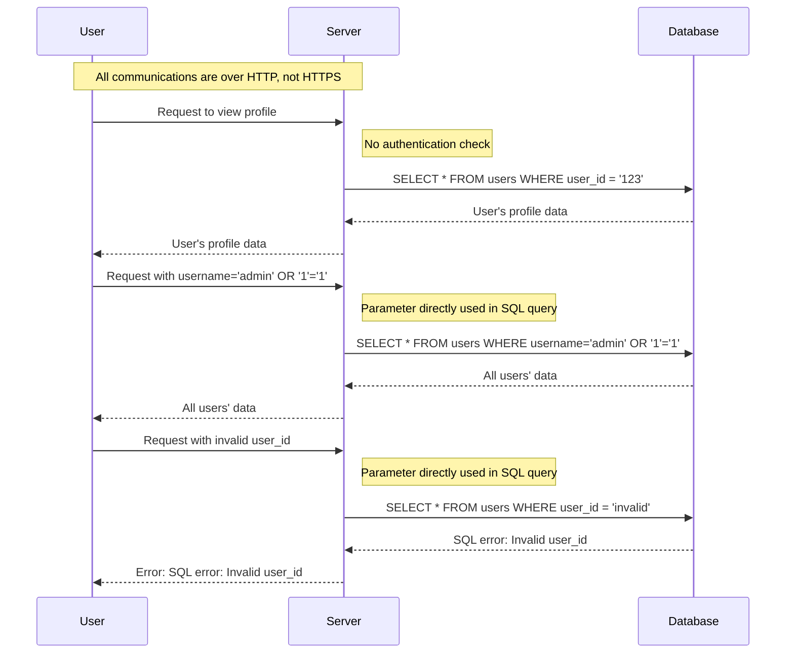

# Threat Model

## Description

The application is a simple web-based user management system designed to allow users to view their profiles after logging in. It consists of a web interface (UI), a server that processes requests, and a database that stores user data.

## Flow

