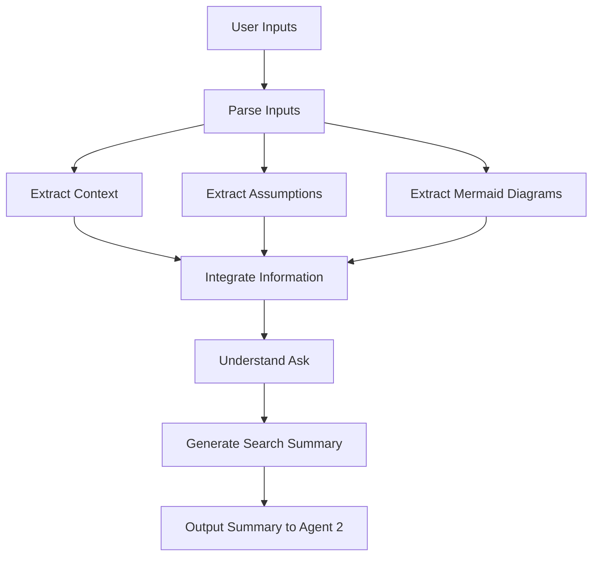
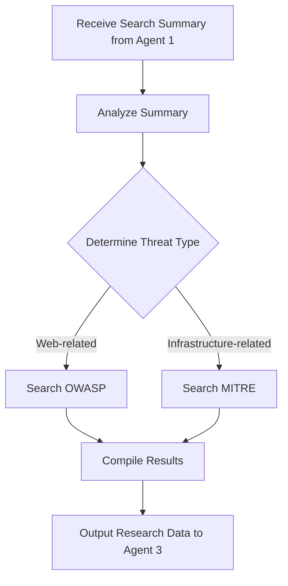
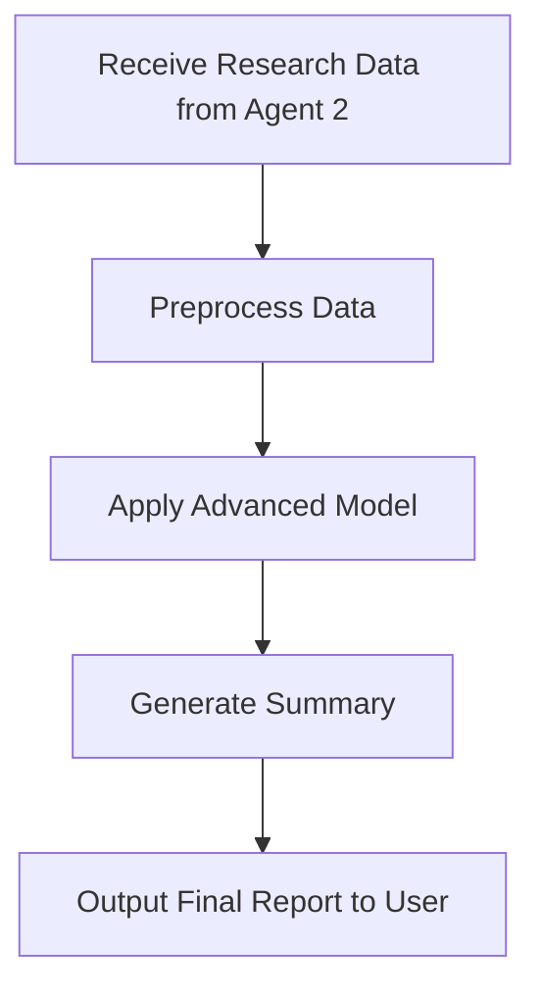

# Agent decision flow

## Agent 1: Input Handler

```mermaid
graph TD
    A[User Inputs] --> B[Parse Inputs]
    B --> C1[Extract Context]
    B --> C2[Extract Assumptions]
    B --> C3[Extract Mermaid Diagrams]
    C1 --> D[Integrate Information]
    C2 --> D
    C3 --> D
    D --> E[Understand Ask]
    E --> F[Generate Search Summary]
    F --> G[Output Summary to Agent 2]
```

## Agent 2: Deep Search

```mermaid
graph TD
    A[Receive Search Summary from Agent 1] --> B[Analyze Summary]
    B --> C{Determine Threat Type}
    C -->|Web-related| D1[Search OWASP]
    C -->|Infrastructure-related| D2[Search MITRE]
    D1 --> E[Compile Results]
    D2 --> E
    E --> F[Output Research Data to Agent 3]
```

## Agent 3: Threat Modeling Summarizer

```mermaid
graph TD
    A[Receive Research Data from Agent 2] --> B[Preprocess Data]
    B --> C[Apply Advanced Model]
    C --> D[Generate Summary]
    D --> E[Output Final Report to User]
```
